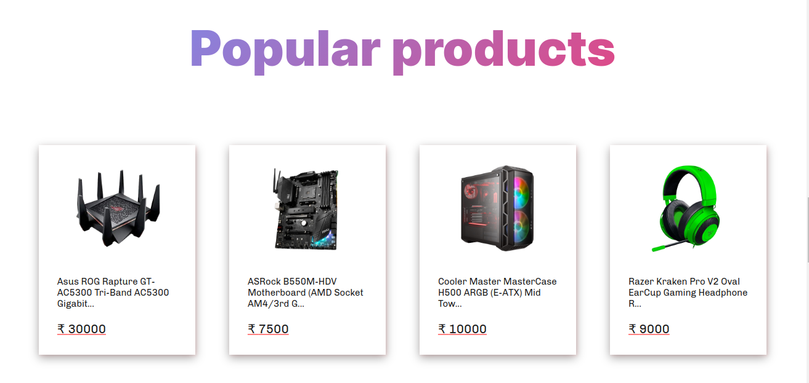
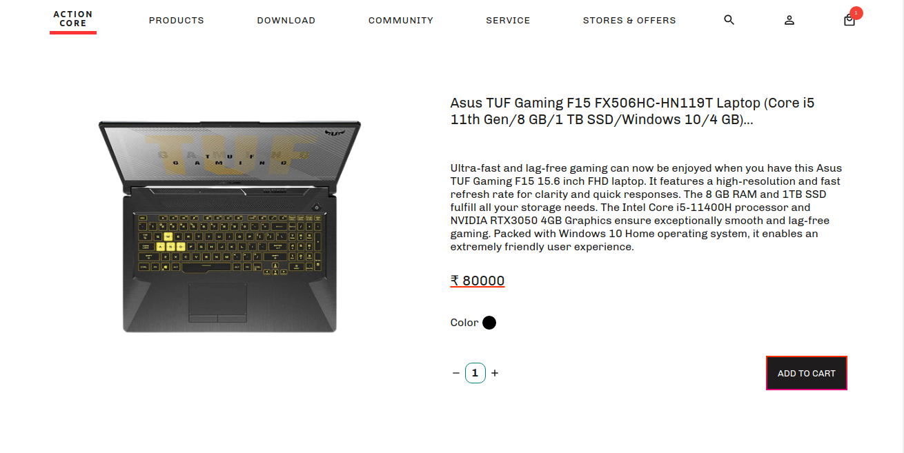
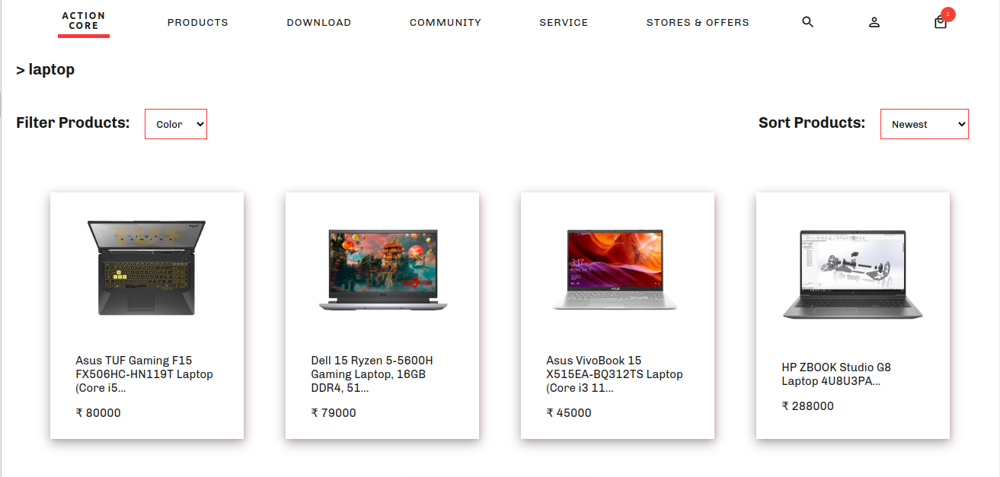
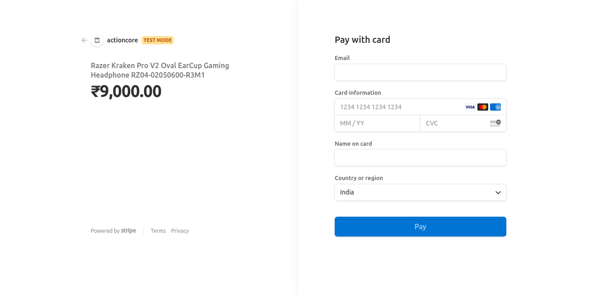

# Action Core
E-com website made with MERN Stack

## Features
 - user management,
 - product filters,
 - search,
 - shopping cart,
 - stripe payment,
 - responsive design,
 - authentication, authorization using JWT. 

# Screenshots

 

 

 

 

 

 

 

# Tools and libraries used

 - Styled components,
 - MaterialUi,
 - MongoDB,
 - Express,
 - React,
 - Redux, 
 - Node, 
 - JWT,
 - Vscode.